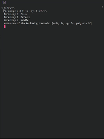

# File-Explorer

## Current State of project:

### Development Roadmap
<ol>
    <li> ✅ Build a basic directory parser that can read and move up a directory from the command line.
    <li> ✅ Add functionality to step into files and be a fully functional command line directory parsers.
    <li> Build a Gui using Tauri displaying the files with with drives and clicking on a folder then clicking open will trigger a change in your present working directory.
    <li> Add functionality to move files, or copy them somewhere, as well as open them with various programs.
    <li> Optimize.
    <li> tweaks and user input.
</ol>

Planning on using Tauri for the GUI but i might use something else that is in full rust.

Version: 1.0.1 :)
<!-- ✅ -->
