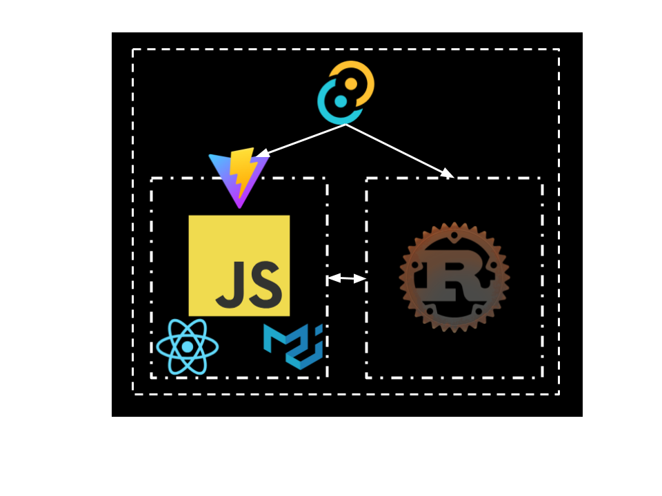

# File-Explorer

Uses a fully written in rust back-end, and a modern front-end framework (Vite), using Tauri to bridge the gap.

### Development Roadmap
<ol>
    <li> ✅ Build a basic directory parser that can read and move up a directory from the command line.
    <li> ✅ Add functionality to step into files and be a fully functional command line directory parsers.
    <li> Create a simple GUI where you can pass a path display files, step in, step out, or open a file.
    <li> Build a Gui using Tauri displaying the files with with drives and clicking on a folder then clicking open will trigger a change in your present working directory.
    <li> Add functionality to move files, or copy them somewhere, as well as open them with various programs.
    <li> Optimize.
    <li> tweaks and user input.
</ol>

### Technologies Used

Version: 1.0.1 :)

<!-- ## Current State of project:

 -->

### Run Program
You will need Node.js installed if it is not installed you can install it [here](https://nodejs.org/en/download/package-manager).

Run `npm install` in the project root.

Run `npm run tauri dev` also in the project root.
<!-- ✅ -->
